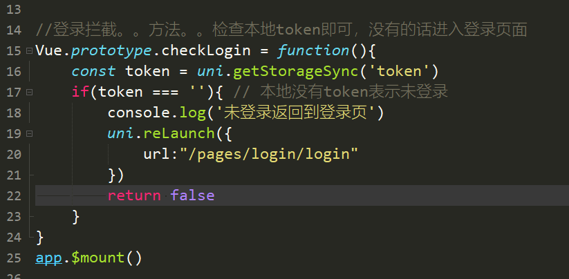

# 到云移动端

## 如何运行

 - 使用uniapp作为主要框架，了解uniapp [uniapp](https://uniapp.dcloud.io/README)
 - 本项目需要借助 Hbuild编译运行，了解Hbuild [Hbuild](https://www.dcloud.io/hbuilderx.html)
 - clone之后先：npm install
 - 打开 Hbuild 打开项目，点击运行到浏览器，提示安装必要插件。安装即可

## 内容展示

### 登录拦截器
 - 代码地址
[主页拦截代码](./main.js)
 - 代码截图

